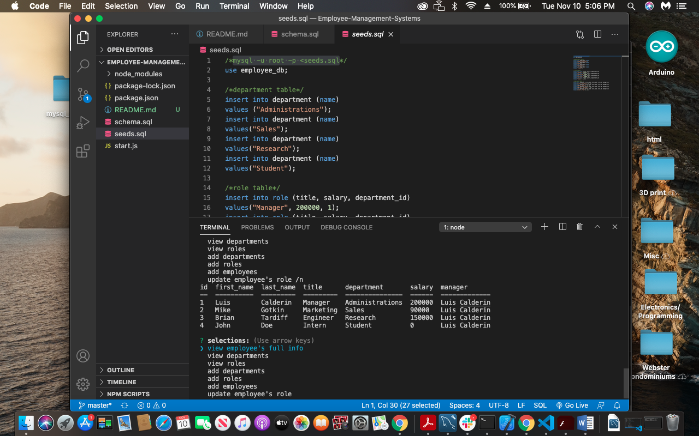

# Employee Management System

## Screenshot
  

## Table of contents
- [Description](#Description)
- [Installation](#Installation)
- [Usage](#Usage)
- [Repository Link](#Repositories)
- [Questions](#Questions?)
- [GitHub Info](#GitHub) 
## Description 
This is an app that allows the adding, modification, and viewing of certain employees. Using Mysql we create a database that allows for the extraction and addition of employees, roles, and departments.
## Installation
npm install mysql, inquirer, and console.table
## Usage
use this to organize your team
## Repositories
- [GitHub Portfolio](https://github.com/lcalderin12)
- [Project Repo](https://github.com/lcalderin12/Employee-Management-Systems/blob/master/start.js)
- [Screen Recording](https://drive.google.com/file/d/1qtZ-ipvWeh9wIR7JBognb8E6-I0H1lXr/view)
## Questions?
- lcalderin12
- luiscalderin007@gmail.com
## GitHub Profile

- Luis Calderin
